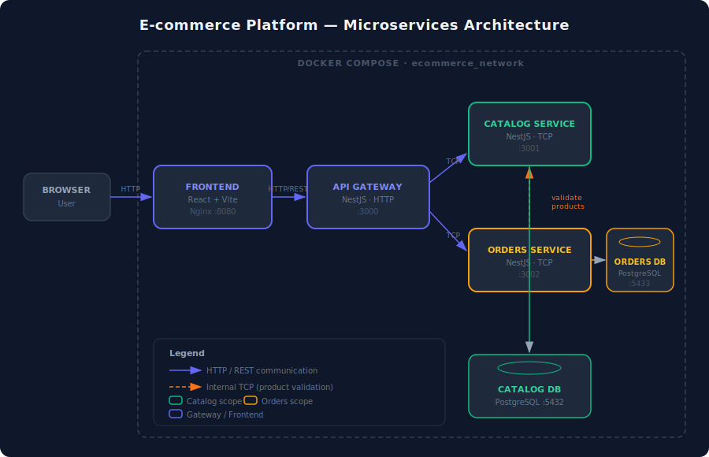
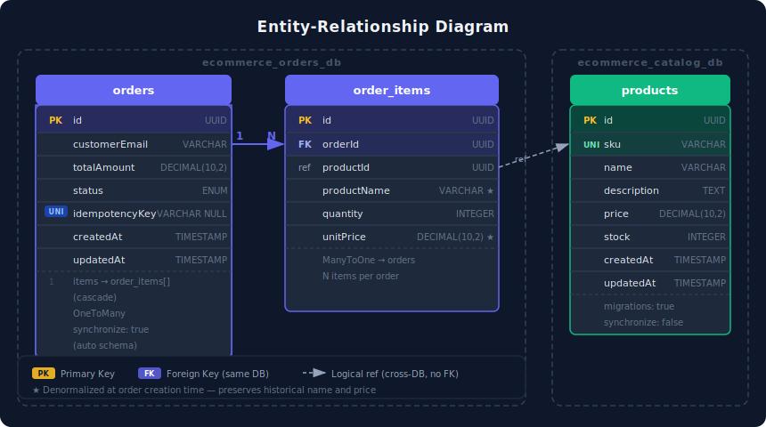
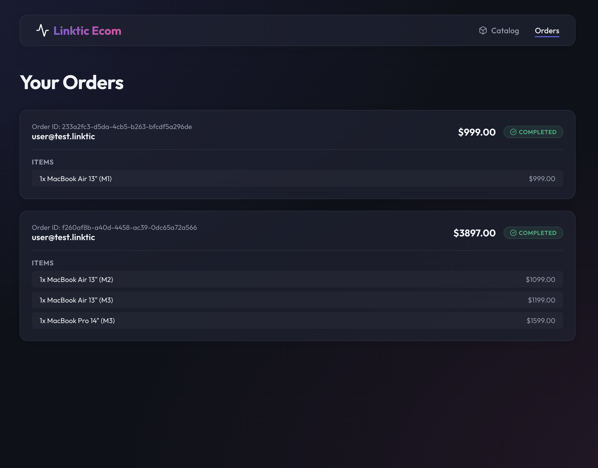
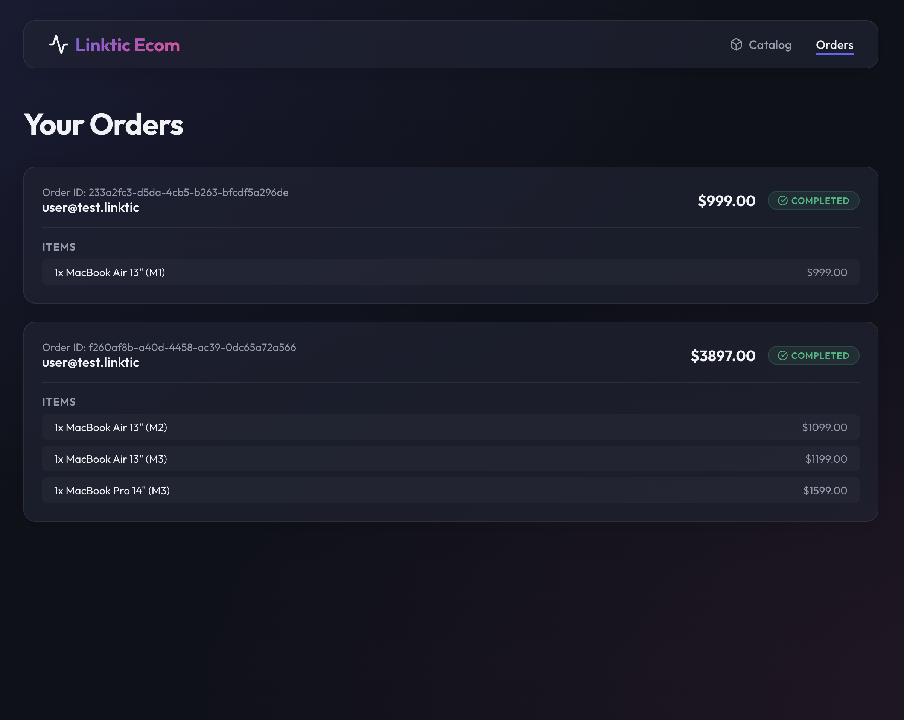
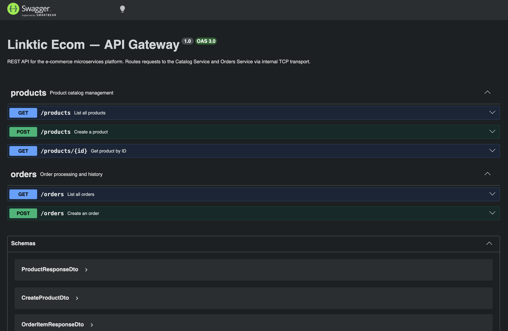

# Linktic Ecom — E-commerce Microservices Platform

> Technical assessment: microservices-based e-commerce platform built with NestJS, PostgreSQL, Docker and React.

---

## Table of Contents

1. [Architecture](#1-architecture)
2. [CI/CD Pipeline](#2-cicd-pipeline)
3. [Backend Services](#3-backend-services)
4. [Frontend](#4-frontend-bonus)
5. [Running the Project](#5-running-the-project)
6. [Technical Decisions](#6-technical-decisions)

---

## 1. Architecture



The platform is built on a **microservices architecture** with a **database-per-service** pattern, ensuring full decoupling between domains.

| Component | Technology | Role |
|---|---|---|
| **API Gateway** | NestJS · HTTP :3000 | Single entry point — routes REST calls to internal services |
| **Catalog Service** | NestJS · TCP :3001 | Manages product catalog and inventory |
| **Orders Service** | NestJS · TCP :3002 | Processes orders, validates products, enforces business rules |
| **Catalog DB** | PostgreSQL :5432 | Exclusive storage for the catalog domain |
| **Orders DB** | PostgreSQL :5433 | Exclusive storage for the orders domain |
| **Frontend** | React + Vite · Nginx :8080 | UI consuming the API Gateway |

### Service Communication

- **Client → API Gateway**: standard HTTP/REST
- **API Gateway → Microservices**: NestJS native **TCP transport** (synchronous, low-latency)
- **Orders → Catalog**: internal TCP call to validate product existence and stock before creating an order

### Scalability & Separation of Concerns

- Each service owns its schema — no cross-database joins
- Services can be scaled, deployed, and updated independently
- The API Gateway is the only component exposed externally; microservices are internal-only
- Business logic is isolated per domain (catalog rules in Catalog Service, order rules in Orders Service)

---

## 2. CI/CD Pipeline

GitHub Actions pipeline defined in [`.github/workflows/ci.yml`](.github/workflows/ci.yml).

### Triggers

- Push to `main`
- Pull requests targeting `main`

### Stages

```
┌─────────────────────────────────────────────────┐
│  build-and-test  (matrix: 3 services in parallel)│
│  ├── actions/checkout                            │
│  ├── Node.js 18 setup + npm cache               │
│  ├── npm ci                                      │
│  ├── npm run build                               │
│  └── npm run test --if-present                   │
└──────────────────────┬──────────────────────────┘
                       │ on main branch only
┌──────────────────────▼──────────────────────────┐
│  release                                         │
│  ├── git config (automation user)                │
│  ├── version bump + CHANGELOG generation         │
│  └── cloud deployment simulation                 │
└─────────────────────────────────────────────────┘
```

The matrix strategy builds and tests **api-gateway**, **catalog-service** and **orders-service** in parallel, failing fast if any service breaks.

---

## 3. Backend Services

### 4.1 Catalog Service — API Reference

All endpoints go through the **API Gateway** at `http://localhost:3000`.

| Method | Endpoint | Description |
|---|---|---|
| `GET` | `/products` | List all products |
| `GET` | `/products/:id` | Get product by UUID |
| `POST` | `/products` | Create a new product |

**POST /products — request body**
```json
{
  "sku": "MBP16-M4",
  "name": "MacBook Pro 16\" (M4)",
  "description": "Apple M4 chip, 24GB RAM, 512GB SSD",
  "price": 2499,
  "stock": 8
}
```

The catalog database is seeded on first run with **15 Apple products** (MacBook Air, MacBook Pro, Mac Studio, Mac Pro, iMac lines).

### 4.2 Orders Service — API Reference

| Method | Endpoint | Description |
|---|---|---|
| `GET` | `/orders` | List all orders with line items |
| `POST` | `/orders` | Create an order |

**POST /orders — request body**
```json
{
  "customerEmail": "user@example.com",
  "items": [
    { "productId": "<uuid>", "quantity": 2 },
    { "productId": "<uuid>", "quantity": 1 }
  ]
}
```

**Headers**
```
Idempotency-Key: <unique-uuid>   (optional — prevents duplicate orders on retry)
Content-Type: application/json
```

**Business validations applied:**
- `customerEmail` must be a valid email address
- `items` array must have at least one item with `quantity ≥ 1`
- All `productId` values must exist in the Catalog Service
- Each product must have sufficient stock

### Data Model



```
orders
├── id              UUID  PK
├── customerEmail   VARCHAR
├── totalAmount     DECIMAL(10,2)
├── status          ENUM (PENDING | COMPLETED | CANCELLED)
├── idempotencyKey  VARCHAR UNIQUE NULLABLE
├── createdAt
└── updatedAt

order_items
├── id              UUID  PK
├── orderId         FK → orders.id
├── productId       UUID  (reference, not FK — decoupled by design)
├── productName     VARCHAR  (denormalized for historical accuracy)
├── quantity        INTEGER
└── unitPrice       DECIMAL(10,2)

products  (catalog DB)
├── id              UUID  PK
├── sku             VARCHAR UNIQUE
├── name            VARCHAR
├── description     TEXT
├── price           DECIMAL(10,2)
└── stock           INTEGER
```

---

## 4. Frontend (Bonus)

A React + Vite single-page application served via Nginx.

### Catalog & Shopping Cart



- Browse the full product catalog with stock indicators
- Add products to cart (increments quantity on repeat)
- Remove individual items from cart
- See real-time cart total

### Orders History



- Place orders with email and idempotency key
- View all past orders with status badges
- Each order shows line items and individual prices

---

## 5. Running the Project

### Prerequisites

- Docker and Docker Compose

### One-command setup (recommended)

```bash
docker compose up -d --build
```

| Service | URL |
|---|---|
| Frontend | http://localhost:8080 |
| API Gateway | http://localhost:3000 |
| **API Docs (Swagger)** | **http://localhost:3000/api/docs** |

> Databases initialize automatically. The catalog is seeded with 15 products on first run.

### API Documentation (Swagger)

Interactive API docs are served by the API Gateway at:

```
http://localhost:3000/api/docs
```



The Swagger UI lets you explore and test all endpoints directly in the browser — no Postman required. The raw OpenAPI spec is also available at `http://localhost:3000/api/docs-json`.

### Verify services are running

```bash
docker compose ps
```

```bash
# List products
curl http://localhost:3000/products

# Create an order
curl -X POST http://localhost:3000/orders \
  -H "Content-Type: application/json" \
  -H "Idempotency-Key: $(uuidgen)" \
  -d '{
    "customerEmail": "test@example.com",
    "items": [{ "productId": "<id-from-products>", "quantity": 1 }]
  }'

# List orders
curl http://localhost:3000/orders
```

### Stop and clean up

```bash
docker compose down          # stop containers
docker compose down -v       # stop and remove volumes (resets databases)
```

### Local development (without Docker)

Requires Node.js 18+ and two running PostgreSQL instances.

```bash
# Terminal 1 — databases only
docker compose up -d ecommerce_catalog_db ecommerce_orders_db

# Terminal 2
cd catalog-service && npm install && npm run start:dev

# Terminal 3
cd orders-service && npm install && npm run start:dev

# Terminal 4
cd api-gateway && npm install && npm run start:dev

# Terminal 5
cd frontend && npm install && npm run dev   # http://localhost:5173
```

### Running tests

```bash
cd api-gateway    && npm test
cd catalog-service && npm test
cd orders-service  && npm test
```

---

## 6. Technical Decisions

| Decision | Rationale |
|---|---|
| **NestJS TCP transport** | Native to NestJS, no extra infrastructure (no RabbitMQ/Kafka needed for synchronous calls), lower latency than HTTP for internal communication |
| **Database-per-service** | Enforces domain boundaries — the Orders Service cannot directly query the Catalog database, forcing proper API contracts |
| **Denormalized `productName` in order items** | Orders must preserve the product name and price at the time of purchase, regardless of future catalog changes |
| **Idempotency key on order creation** | Prevents duplicate orders caused by network retries or double-clicks |
| **Multi-stage Dockerfiles** | Smaller production images — build tools stay in the builder stage, only the compiled output ships |
| **Health checks + `depends_on`** | Ensures databases are ready before services start, avoiding connection errors on cold boot |
| **`synchronize: false` + migrations (catalog)** | Production-safe schema management with explicit migration history |
